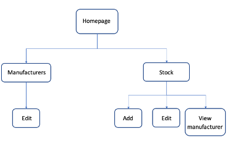

**Stock Watch**

**What is it?**

A custom stock and manufacturer tracking application for a fabric warehouse

**The brief**

Build an app which allows a shopkeeper to track their shop’s inventory. This is not an app which the customer will see, it is ad admin/management app. Use only:

-	HTML/CSS
-	Python
-	Flask
-	PostgreSQL (psql) and the psycopg

**Setup**

1.	Open stock_watch in VS Code
2.	Open Google Chrome
3.	In VS Code open three terminal windows and run the following commands:

Terminal 1:

    dropdb stock_watch
    enter
 
    createdb stock_watch
    enter
    
    psql -d stock_watch -f db/stock_watch.sql
    enter

Terminal 2:

    Flask run
    enter

Terminal 3:

    python3 console.py
    enter
    (seeds database)

4.	In Chrome, in the browser enter:

http://localhost:5000/

You should now see Stock Watch on the web page.

_Note_: if console.py is quit (command ‘q’) any additions, edits and deletions from the database will be lost. Running console.py again will return the content of the db to the ‘starter’ content present in console.py.

**Using the app**

The app is structured as follows,

 

 - The stock page includes a filter function that allows fabrics to be filtered by colour or manufacturer or both.

 - Stock and manufacturers can be deleted on the manufacturers and stock pages respectively. Manufacturers can be added via a form on the manufacturers page but new stock, which has more fields, is added via a form on a separate page.

**Closing down**

Quit psql command:	\q

Quit Flask command:	ctrl + C

Quit console command:	q

Close VS Code and Chrome

END
